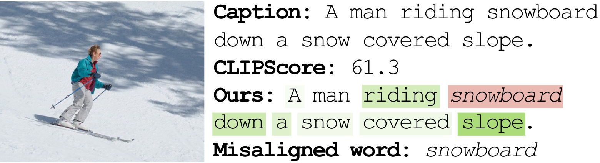

<div align="center">
    
# Extract Free Dense Misalignment from CLIP (AAAI'25)
 [](https://ojs.aaai.org/index.php/AAAI/article/view/32660)
 [](https://arxiv.org/abs/2412.18404) [](https://colab.research.google.com/drive/1UV8GMhj1VCV9QboucGSnSIo95UWWK6eY?usp=sharing) [](./misc/CLIP4DM_poster.pdf)
<p align="center">
  
</p>
</div>

> Recent vision-language generative models still frequently produce outputs misaligned with their inputs, evidenced by object hallucination in captioning and prompt misalignment in the text-to-image generation model. Recent studies have explored methods for identifying misaligned elements, aiming not only to enhance interpretability but also to improve model performance. However, current approaches primarily rely on large foundation models in a zero-shot manner or fine-tuned models with human annotations, which limits scalability due to significant computational costs. This work proposes a novel approach, dubbed CLIP4DM, for detecting dense misalignments from pre-trained CLIP, specifically focusing on pinpointing misaligned words between image and text. We carefully revamp the gradient-based attribution computation method, enabling negative gradient of individual text tokens to indicate misalignment. We also propose F-CLIPScore, which aggregates misaligned attributions with a global alignment score. We evaluate our method on various dense misalignment detection benchmarks, covering various image and text domains and misalignment types. Our method demonstrates state-of-the-art performance among zero-shot models and competitive performance with fine-tuned models while maintaining superior efficiency. Our qualitative examples show that our method has a unique strength to detect entity-level objects, intangible objects, and attributes that can not be easily detected for existing works. We conduct ablation studies and analyses to highlight the strengths and limitations of our approach.

## setup
To set up the environment, start with the following base image and install the required dependencies:

```bash
# starts with nvcr.io/nvidia/pytorch:21.10-py3
pip install -r requirements.txt
```
You can find optional dependancies [here](./requirements.txt).

## Inference test 

To run a simple test:
```bash
python infer.py
```
This will result as follows:

```python
{
    'negative_word': '3_coke',
    'sum_negative_attribution': -0.0004444122314453125,
    'negative_word_score_list': [-0.0004444122314453125],
    'clip_score': 0.52459716796875,
    'word_attributions': [
        ('a', -3.6835670471191406e-05),
        ('cup', 0.0002104043960571289),
        ('of', 5.716085433959961e-05),
        ('coke', -0.0004444122314453125)
    ]
}
``` 

## Run Evaluation 
### Prepare data
#### FOIL

1) Download the FOIL test set in this [link](https://foilunitn.github.io/).
2) Download COCO14 val set image in this [link](https://cocodataset.org/#download).
3) (Optional) To reproduce ref-CLIPScore, download coco14 val annotation in this [link](https://cocodataset.org/#download).

#### nocaps-FOIL

1) Download nocaps-FOIL JSON file in this [link](https://github.com/DavidMChan/aloha/blob/main/data/nocaps-val-foil.json) and place it in $NOCAPS_FOIL_PATH.
2) Download nocaps validation JSON file in this [link](https://nocaps.s3.amazonaws.com/nocaps_val_4500_captions.json) and place it in $NOCAPS_META_PATH.
3) Download images using the following command: `python misc/download_nocaps_image.py --foil_path $NOCAPS_FOIL_PATH --meta_path $NOCAPS_META_PATH --save_dir ./data/nocaps`.

#### HAT

1) Download JSON file in this [link](https://github.com/DavidMChan/aloha/blob/main/data/hat-trainval.json).
2) Download COCO14 validation set images in this [link](https://cocodataset.org/#download).

#### Rich-HF

1) Download json file in this [link](https://github.com/google-research-datasets/richhf-18k/blob/main/test.tfrecord) and put it in $RICHHF_FOIL_PATH.
2) Install `pip install datasets && pip install Pillow==9.4.0` and download image with `python misc/download_richhf_image.py --foil_path $RICHHF_FOIL_PATH --save_dir ./data/richhf/test`.

#### SeeTrue-Feedback

1) SeeTrue requires the datasets package, which conflicts with Pillow==8.4.0. Resolve this by running: `pip install datasets && pip install Pillow==9.4.0`.

### Main Evaluation

You can execute the script with different configurations using the following command-line arguments. Here's a simple example:
```bash
python main.py --data_path ./data/nocaps_val.json --img_dir ./data/nocaps/
```

Below are the descriptions of the arguments you can use to configure the script.
- `--data_path`: Path to the JSON file containing the data. Default: `./data/nocaps_val.json`.
- `--img_dir`: Directory where the images are stored. Default: `./data/nocaps`. 
- `--start_layer_text`: Start layer for the text transformer. Default: `-3`. 
- `--output`: Directory where the output files will be saved. Default: `./output`. 
- `--template`: Template prompt used in the text encoder. Default: `A photo depicts `.
- `--backbone`: Name of the model backbone to use. Default: `ViT-B-32`. 
- `--pretrained`: Name of the pre-trained model. Default: `None`. 
- `--sorted_by`: Method for aggregating results. Options: `most_negative` or `threshold`. Default: `threshold`. 
- `--epsilon`: Threshold value for misalignment detection. Default: `-5e-5`.
- `--get_refclipscore`: Calculate reference-based CLIPScore. Default: `False`. 
- `--reference_path`: Path to the COCO captions JSON file for reference-based CLIPScore. Default: `None`.


## Acknowledgements

We would like to express our gratitude to the following open-source projects, which have greatly inspired and supported our work:

- [Transformer-MM-Explainability](https://github.com/hila-chefer/Transformer-MM-Explainability)
- [CLIPScore](https://github.com/jmhessel/clipscore)
- [OpenCLIP](https://github.com/mlfoundations/open_clip)
- [Transformers](https://github.com/huggingface/transformers)

## How to cite
```
@inproceedings{nam2025extract,
  title={Extract free dense misalignment from CLIP},
  author={Nam, JeongYeon and Im, Jinbae and Kim, Wonjae and Kil, Taeho},
  booktitle={Proceedings of the AAAI Conference on Artificial Intelligence},
  volume={39},
  number={6},
  pages={6173--6181},
  year={2025}
}
```
## License
```
CLIP4DM
Copyright (c) 2025-present NAVER Cloud Corp.

Licensed under the Apache License, Version 2.0 (the "License");
you may not use this file except in compliance with the License.
You may obtain a copy of the License at

    http://www.apache.org/licenses/LICENSE-2.0

Unless required by applicable law or agreed to in writing, software
distributed under the License is distributed on an "AS IS" BASIS,
WITHOUT WARRANTIES OR CONDITIONS OF ANY KIND, either express or implied.
See the License for the specific language governing permissions and
limitations under the License.
```
